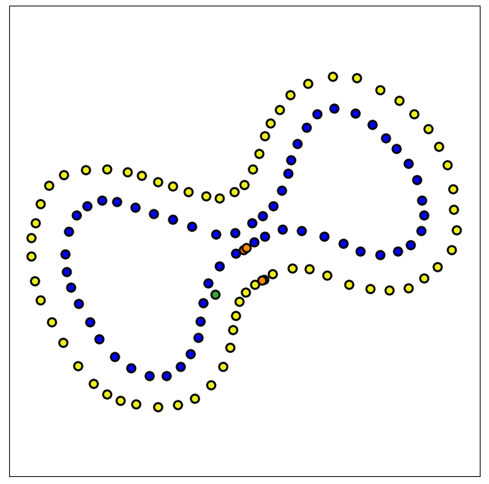

# rtk_mapper

[](https://github.com/siliconlad/rtk_mapper/actions/workflows/test.yaml)

<p align="center">

</p>

[`rtk_mapper`](https://github.com/siliconlad/rtk_mapper) is a ROS 2 package which provides a GUI interface to help with
viewing and recording landmark positions using a
RTK-enabled GNSS receiver ([such as](https://www.ardusimple.com/product/simplertk2b-starter-kit-lr-ip65/)). The
specific use-case for this application is
[Formula Student AI](https://www.imeche.org/events/formula-student/team-information/fs-ai).

The package contains two ROS nodes:

1. `mapper`: a GUI utility to help map tracks
2. `viewer`: a GUI utility to quickly view tracks stored in a CSV file

## Requirements

This package requires [ROS 2 Galactic](https://docs.ros.org/en/galactic/Installation.html) and on the following
third-party Python packages:

1. [pygame](https://pypi.org/project/pygame/)
2. [numpy](https://pypi.org/project/numpy/)
3. [pandas](https://pypi.org/project/pandas/)
4. [matplotlib](https://pypi.org/project/matplotlib/)
5. [utm](https://pypi.org/project/utm/)

## Installation

First, clone this repository into your ROS workspace:

```bash
$ mkdir -p ~/dev_ws/src
$ cd ~/dev_ws/src
$ git clone git@github.com:siliconlad/rtk_mapper.git
```

Next, define the `$EUFS_MASTER` environment variable to point to your ROS workspace:

```bash
$ export EUFS_MASTER=$HOME/dev_ws
```

Finally, we need a `map` directory in `$EUFS_MASTER`. This is where `mapper` saves all maps:

```bash
$ mkdir -p $EUFS_MASTER/map
```

## Mapper

`mapper` works by reacting to different keyboard inputs to create a map composed of **markers**. Markers can be
one of the following types and represent different concepts:

1. `BLUE`: represents a blue cone
2. `YELLOW`: represents a yellow cone
3. `ORANGE`: represents a orange cone
4. `BIG_ORANGE`: represents a big orange cone
5. `CAR_START`: represents the rough starting position of the car

The first 4 marker types are self-explanatory. They allow the captured location to be associated with a cone color.
`CAR_START` is used to help transform the GPS coordinates of each map into a 'normalized map'. In a normalized map, the
GPS coordinates are first transformed into
[UTM coordinates](https://en.wikipedia.org/wiki/Universal_Transverse_Mercator_coordinate_system). Then each marker
is translated so that `CAR_START` is at `(0,0)`. Finally, a rotation is applied so that the `BIG_ORANGE` cones
(specifically the average position of the 4 closest `BIG_ORANGE` cones to `CAR_START`) indicating the start/finish line
lies along the `x`-axis. This format is useful because coordinates are in meters and the car starts pointing along
the `x-direction` (assuming a straight between `CAR_START` and the start/finish line, which is reasonable I think).

`mapper` operates in two modes:

1. **Normal mode**: Normal mode is the mode you will be using most of the time. With this mode, you can add new markers
   to the map and delete the last recorded marker to correct a mistake.
2. **Update mode**: Update mode is used to modify a map. In this mode you can select a cone by pressing `TAB`. You can
   then delete the selected cone, or update its position. You cannot add new markers in this mode.

When the program is quit, two CSV files are saved to `$EUFS_MASTER/map` (see CSV File Formats section).

### Usage

Assuming you have the necessary packages installed, to running `mapper` is very simple. Simply build, source
and run:

```bash
$ cd $EUFS_MASTER
$ colcon build
$ . install/setup.bash
$ ros2 run rtk_mapper mapper
```

At this point, a GUI should show up with an empty matplotlib figure.

#### Keyboard Inputs

The complete list of keys and their meaning in the two different modes are as follows:

|   Key   |   Mod   | Normal Mode Description       | Update Mode Description       |
|:-------:|:-------:|:------------------------------|-------------------------------|
|   `b`   |    -    | select BLUE marker type       | select BLUE marker type       |
|   `y`   |    -    | select YELLOW marker type     | select YELLOW marker type     |
|   `o`   |    -    | select ORANGE marker type     | select ORANGE marker type     |
|   `o`   | `SHIFT` | select BIG_ORANGE marker type | select BIG_ORANGE marker type |
|   `c`   |    -    | select CAR_START marker type  | select CAR_START marker type  |
|   `d`   |    -    | delete last added marker      | delete selected marker        |
|   `u`   |    -    | enter update mode             | exit update mode              |
|  `TAB`  |    -    | -                             | select prev marker            |
|  `TAB`  | `SHIFT` | -                             | select next marker            |
|   `q`   |    -    | save and quit                 | save and quit                 |
| `SPACE` |    -    | capture `NavSatFix` messages  | capture `NavSatFix` messages  |

### Topic

The `mapper` node subscribes to the `/fix` topic. It must have
type [`sensor_msgs/msg/NavSatFix`](http://docs.ros.org/en/api/sensor_msgs/html/msg/NavSatFix.html).

### Parameters

`mapper` has the following parameters:

|   Name    |   Type   | Description                                                                                                        |
|:---------:|:--------:|:-------------------------------------------------------------------------------------------------------------------|
|   debug   |  `bool`  | Enable debug logging                                                                                               |
|    map    | `string` | Path to a csv file whose contents are loaded into `rtk_mapper`                                                     |
| threshold |  `float`  | Variance threshold above which a warning is given. Useful to quickly tell if recorded position is accurate enough. |

## Viewer

`viewer` is a simple program which takes a path to a CSV file and plots it in the GUI. No operations can be performed
on the map. This is a read only mode of the map.

### Parameters

`viewer` has the following parameters:

|   Name    |   Type   | Description                                               |
|:---------:|:--------:|:----------------------------------------------------------|
|    map    | `string` | Path to a csv file whose contents are plotted in the GUI. |

## CSV File Formats

The two nodes in this package operate on the following CSV file formats.

The first is a raw, unprocessed CSV file of the following structure:

| Name          | Description                   |
|---------------|-------------------------------|
| `type`          | marker type                   |
| `latitude`      | GPS latitude                  |
| `longitude`     | GPS longitude                 |
| `latitude_var`  | Latitude variance             |
| `longitude_var` | Longitude variance            |
| `covariance`    | latitude-longitude covariance |

The second is a CSV file of the 'normalized map' described in the introduction. The format is what is used in
[`eufs_sim`](https://gitlab.com/eufs/eufs_sim), and hence can be loaded directly into it.

| Name          | Description             |
|---------------|-------------------------|
| `tag`           | marker type             |
| `x`             | x position              |
| `y`             | y position              |
| `direction`     | angle from x-axis       |
| `x_variance`    | variance in x direction |
| `y_variance`    | variance in y direction |
| `xy_covariance` | covariance of x and y   |
